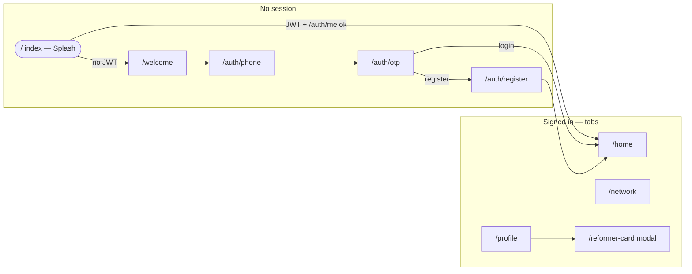

# IRO Reformer — project structure & navigation

This app uses **Expo Router** (file-based routing). The `app/` directory defines **URLs and navigation hierarchy**; `src/` holds **screens, UI, API, and state** that those routes render.

---

## Directory overview

```
myApp/
├── app/                      # Routes only (thin wrappers → src/screens)
│   ├── _layout.tsx           # Root: fonts, Redux, Stack navigator
│   ├── index.tsx             # Entry: Splash
│   ├── welcome.tsx
│   ├── reformer-card.tsx     # Modal over the stack
│   ├── auth/
│   │   ├── _layout.tsx       # Auth sub-stack
│   │   ├── phone.tsx
│   │   ├── otp.tsx
│   │   └── register.tsx
│   └── (tabs)/               # Route group: name does NOT appear in URL
│       ├── _layout.tsx       # Bottom tabs + hydrate auth from storage
│       ├── home.tsx          # Tab: Volunteer home
│       ├── network.tsx       # Tab: Network
│       └── profile.tsx       # Tab: Profile
├── src/
│   ├── api/                  # Axios client + domain calls (e.g. auth)
│   ├── components/ui/        # Reusable UI (Button, Card, …)
│   ├── config/               # api.config.ts (BASE_URL, etc.)
│   ├── navigation/
│   │   └── nav.ts            # Typed-safe navigation helper around router
│   ├── screens/              # Real screen UI + logic
│   ├── store/                # Redux Toolkit (auth slice)
│   ├── theme/                # colors, typography, spacing
│   ├── types/                # TypeScript models
│   └── utils/                # storage (AsyncStorage keys), helpers
├── assets/
├── app.json
├── package.json
└── tsconfig.json             # `"@/*"` → project root
```

**Convention:** `app/*.tsx` files stay small; they import and export one component from `src/screens/...`. This keeps routing and product code separated.

---

## How routing works (Expo Router)

1. **Files = routes.** Each file under `app/` (except `_layout.tsx`) maps to a path segment.
2. **Groups** like `(tabs)` are only for organization; they **do not** add `/tabs` to the URL.
3. **`_layout.tsx`** defines the navigator for that folder:
   - Root `app/_layout.tsx` → **Stack** (splash, welcome, auth stack, tabs, modal).
   - `app/auth/_layout.tsx` → **Stack** for phone → otp → register.
   - `app/(tabs)/_layout.tsx` → **Tabs** for home, network, profile.

### URL map

| File | URL | Role |
|------|-----|------|
| `app/index.tsx` | `/` | Splash (checks token, then redirects) |
| `app/welcome.tsx` | `/welcome` | Welcome / CTA |
| `app/auth/phone.tsx` | `/auth/phone` | Phone + OTP request (`?mode=register\|login`) |
| `app/auth/otp.tsx` | `/auth/otp` | OTP verify (`phone`, `mode` params) |
| `app/auth/register.tsx` | `/auth/register` | Registration wizard (`phone` param) |
| `app/(tabs)/home.tsx` | `/home` | Main dashboard tab |
| `app/(tabs)/network.tsx` | `/network` | Network tab |
| `app/(tabs)/profile.tsx` | `/profile` | Profile tab |
| `app/reformer-card.tsx` | `/reformer-card` | Reformer ID card (modal presentation) |

**Why `/` is not the first tab:** `app/index.tsx` is reserved for **splash**. The first tab lives at **`/home`** so it never conflicts with `/`.

---

## User flow (high level)



- **`nav.replace(...)`** clears the stack for that branch (e.g. splash → welcome or home) so the user cannot go “back” into splash.
- **`nav.push(...)`** adds a screen (e.g. open `/reformer-card` from profile).
- **`nav.pushParams(path, { ... })`** passes search params (e.g. `mode` on phone screen).

Implementation: `src/navigation/nav.ts` wraps `expo-router`’s `router` so paths stay consistent with strict TypeScript.

---

## State & persistence

- **Redux** (`src/store/`): in-memory `auth` slice (`token`, `user`).
- **AsyncStorage** (`src/utils/storage.ts`): `jwt_token`, `current_user` JSON.
- **Tabs layout** (`app/(tabs)/_layout.tsx`): on mount, reads storage and **dispatches `setCredentials`** so tabs see the user even if Redux was empty after a cold start.

API calls use **`src/api/client.ts`** (axios); `API_BASE_URL` is in **`src/config/api.config.ts`**.

---

## Adding a new screen

1. Add UI in `src/screens/.../MyScreen.tsx`.
2. Add a route file in `app/`, e.g. `app/my-feature.tsx`, that renders `<MyScreen />`.
3. Navigate with `nav.push('/my-feature')` or register the screen in a `_layout` if it belongs inside a stack or tab.

For a **new tab**, add `app/(tabs)/my-tab.tsx` and register it in `app/(tabs)/_layout.tsx` with `<Tabs.Screen name="my-tab" ... />`.

---

## Related docs

- [Expo Router — Introduction](https://docs.expo.dev/router/introduction/)
- [Navigation patterns](https://docs.expo.dev/router/advanced/stack/)
